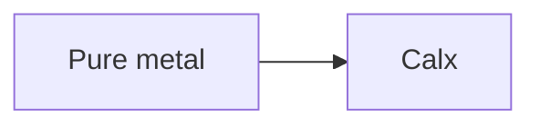

# AnimMD: Format Specification v0.1

> Part of the [LearnSpec](/) suite. Draft, August 25, 2026.
> Companion format: attaches to scenes declared by [DiagramMD](/diagrammd/) or [MediaMD](/mediamd/); referenced from [LearnMD](/learnmd/).

---

## Core Principle

AnimMD is the **step-reveal animation format** of the LearnSpec suite. An AnimMD script narrates an *existing* vector scene, a diagram from a DiagramMD catalogue, an SVG asset from a MediaMD catalogue, by revealing its elements step by step, each step paired with a caption.

AnimMD deliberately is **not** an animation authoring format: there is no timeline, no keyframe, no easing curve, and the script never contains a coordinate. It only chooses the **order of revelation** of elements the scene already contains, addressed through a binding layer. This constraint is what makes the format safe to author with an LLM and safe to render anywhere: every failure mode degrades to the static scene the host already displays.

| Principle | Description |
|---|---|
| **Markdown-first** | An AnimMD script is valid Markdown, readable in any editor: one heading per step, prose captions |
| **Scene-agnostic** | The script addresses *names*; a per-generator adapter resolves them, the script never contains a renderer id |
| **Graceful degradation** | Unknown name → directive skipped; malformed directive → caption prose; unparseable script → static scene. Never worse than the status quo |
| **Learner-paced** | Steps advance on the reader's gesture (tap, key, scroll). No autoplay, no video |
| **AI-native** | The step list fails *well* under LLM authoring, where a timeline fails silently |

AnimMD is a **companion format**: it never stands alone in front of a learner. It attaches to a scene declared by a host format (see [Embedding](#embedding-in-host-formats)).

---

## Script Structure

A script is a YAML frontmatter block followed by one section per step:

```markdown
---
pace: learner
captions: overlay
bind:
  metal:       {node: A}
  calcination: {edge: [A, B]}
  legende-3:   {label: "chaux"}
---

## The pure metal
show: metal
focus: metal

It starts from a workshop fact: a heated metal turns into calx.

## The calcination
draw: calcination
focus: calcination

The transformation both rival theories must explain.
```

### Frontmatter keys

| Key | Required | Default | Description |
|---|---|---|---|
| `bind` | **Yes** | none | Mapping of author-chosen names to [binding intents](#the-binding-layer). At least one entry |
| `pace` | No | `learner` | Only `learner` is defined: steps advance on the reader's gesture. Unknown values are treated as `learner` |
| `captions` | No | `overlay` | Caption-panel anchor: `overlay` pins the step caption over the bottom edge of the scene so the narration stays visible *on* the diagram; `below` renders a detached panel under the scene |
| `badges` | No | `false` | Narrative step-number badges drawn as a render-time overlay on the scene. The scene source is **never** renumbered |

Unknown frontmatter keys are tolerated and ignored (hosts may add embedding keys such as `for:` or `lang:`).

### Steps

Each `## Heading` opens a step. The heading text is the step title. The lines immediately following the heading that match

```
<verb>: <name>[, <name>…]
```

are **directives**; the first line that does not match ends the directive block, and everything after it is the step **caption** (plain prose; `*emphasis*` is the only markup a player must honour, captions come from user-editable files and MUST be escaped before any markup is applied).

A step with zero directives is legal (a caption-only narrative beat). A script must contain at least one step.

### Verbs

Five verbs, deliberately no more:

| Verb | Effect | Class |
|---|---|---|
| `show` | Reveal the target(s) | **Cumulative**: stays until `hide` |
| `hide` | Conceal the target(s) | **Cumulative** |
| `draw` | Reveal by animating the stroke (`stroke-dashoffset`); falls back to `show` for targets with no drawable path | **Cumulative** |
| `focus` | Emphasise the target(s), dim every other bound element | **Momentary**: applies only on its own step |
| `pulse` | Draw attention (scale pulse) | **Momentary**; suppressed under `prefers-reduced-motion` |

**Replay semantics (normative).** The state of step *n* is computed by replaying the cumulative verbs of steps 0..*n*, then applying step *n*'s momentary verbs. Forward navigation, backward navigation, and random access all take this same path, there is no incremental state. Elements not bound by any name are **background**: always visible, dimmed under `focus`, never touched by directives.

---

## The Binding Layer

A script never contains a generator id. It declares **intents**, and a per-generator adapter resolves them against the rendered scene.

### Bind names

`[a-z0-9][a-z0-9_-]{0,63}`, lowercase kebab, safe inside CSS selectors and prompts without escaping.

### Intents

Exactly three shapes, written as YAML flow mappings:

| Intent | Example | Resolves to |
|---|---|---|
| `{node: ID}` | `{node: A}` | The node the scene's *source* declares as `ID` |
| `{edge: [SRC, DST]}` | `{edge: [A, B]}` | The edge from `SRC` to `DST`, **including its label**, if the renderer emits one |
| `{label: "text"}` | `{label: "calx"}` | Any element whose text content contains `text`. The weakest binding; validators SHOULD warn |

`ID`, `SRC`, `DST` match `[A-Za-z][A-Za-z0-9_]*` and refer to identifiers in the scene's **source** (e.g. the node ids a Mermaid author wrote), never to ids in the rendered output.

### Adapters (normative constraints)

An adapter translates intents into element lookups for one renderer family. Two constraints bind every adapter:

1. **Match patterns, never exact rendered ids.** Renderers namespace their output per render (instance prefixes, unguessable counters). An adapter that stores or compares an exact rendered id breaks silently on the next render.
2. **An edge is one name, however many elements realise it.** If the renderer splits an edge into a path and a label group, the adapter must return both, hiding an edge must hide its label, or captions float over nothing.

*Informative, Mermaid flowcharts.* A node declared `A` renders as an element whose id contains the substring `-flowchart-A-` (instance prefix before, internal counter after); an edge `A --> B` is carried by **two** elements sharing the renderer-emitted attribute `data-id` with prefix `L_A_B_` (the edge path and its label group). Adapters match those patterns. Flowchart labels live in `<foreignObject>` while other diagram types use `<text>`, which is why `{label: …}` is fragile on this family.

*Informative, prepared SVG assets.* For an asset whose drawable leaves carry stamped ids (see MediaMD `bindings` below), resolution is a direct id lookup; the asset-level bindings map plays the role the adapter plays for generated scenes.

### Build-time gate

Because a producing pipeline holds both the scene and the script, it SHOULD verify that every binding resolves against the rendered scene **before publishing**, and drop the script (never the scene) when any binding fails. Runtime skipping then remains the last safety net, not the normal path.

---

## Embedding in Host Formats

The asset owns the addressing; the content owns the reference. AnimMD defines three embeddings:

### DiagramMD: companion block

A catalogue entry gains a sibling fenced block whose `for:` attribute names the entry it animates:

`````markdown


```anim for:calcination
---
bind:
  metal: {node: A}
  calx:  {node: B}
---

## The pure metal
show: metal

It starts from a workshop fact.
```
`````

One `anim` block per entry (later duplicates are ignored; parsers MUST preserve, never destroy, an `anim` block whose `for:` matches no entry). Removing the entry removes its companion.

### MediaMD: asset fields

A media entry (SVG asset) gains two optional fields:

| Field | Type | Description |
|---|---|---|
| `bindings` | mapping | `name → {shapes: [id, …], callout: n}`, the addressing contract between author-chosen names and the asset's stamped shape ids (and legend callout numbers, when the asset has a numbered legend). Verifiable at import: every listed shape id must exist in the asset |
| `animation` | string | A default AnimMD script shipped with the asset. Its `bind:` entries may name `bindings` keys directly |

### LearnMD: reference block

A content file opts into playback with a reference fence, mirroring the host's diagram reference syntax:

`````markdown
```anim ref:calcination
```
`````

Empty body (reserved). Attribute overrides (`caption:"…"`, `width:…`, `alt:"…"`) follow the same precedence as the host's diagram references. A plain diagram reference **never** auto-upgrades to a player: hiding content behind steps changes the reading experience and must be the author's explicit choice.

---

## Graceful Degradation (normative)

| What goes wrong | What the reader sees |
|---|---|
| A directive names an unbound or unresolvable name | That directive is skipped; the rest of the step plays |
| A directive line is malformed, or uses an unknown verb | The line is read as caption prose |
| Zero bindings resolve against the scene | The scene renders statically |
| The whole script is unparseable | The scene renders statically |
| The reference names an entry with no script | Exactly what the host's plain reference renders |

The worst case is always the static scene the host already ships. This asymmetry is the format's central design argument.

---

## Accessibility

- `prefers-reduced-motion` suppresses `pulse` entirely and renders `draw` in its final state; `show`/`hide` remain (the state change is content, not decoration).
- Step captions SHOULD be announced to assistive technology as they change (e.g. a polite live region).
- Players SHOULD offer keyboard navigation (next/previous/first/last) on a focusable player element.
- `badges: true` overlays are decoration and must never be the only carrier of step order.

---

## Validation

Two modes, mirroring the rest of the suite:

**Lenient (default)**: blocking issues only:
- missing or empty `bind`
- a bind value outside the three intent shapes, or an invalid bind name
- zero steps
- a directive targeting a name absent from `bind`

**Warnings** (promoted to errors in strict mode):
- `{label: …}` bindings (fragile resolution)
- bind names never used by any step
- unknown `pace` / `captions` values (treated as defaults)
- node ids containing `_` used in an edge intent (ambiguous join in some adapters)
- more than 30 steps

With the scene source available, validators SHOULD additionally check that every `{node}` / `{edge}` id exists in it.

---

## What AnimMD Does Not Do

- **No geometry.** Coordinates stay where a renderer or a specialist put them.
- **No autoplay, no timing.** Pacing belongs to the reader.
- **No renumbering.** A scene with printed callout numbers keeps them; narrative order is a render-time overlay (`badges`), preserving the asset's provenance and letting one asset carry several stories.
- **No quality judgement.** Parse success and binding resolution are blind to a pedagogically wrong step order; that gate belongs to the producing pipeline, not to this format.

---

## Version

| Version | Date | Changes |
|---|---|---|
| 0.1 | 2026-08-25 | Initial draft: five verbs, replay semantics, binding layer, host embeddings (DiagramMD / MediaMD / LearnMD), degradation and validation rules |
