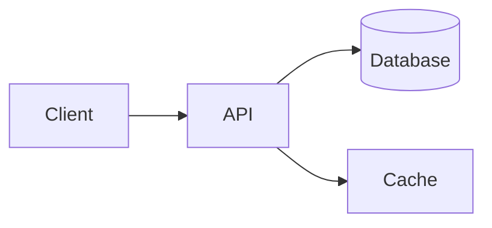

# DiagramMD

**The diagram format of the [LearnSpec](/) suite — and the canonical syntax reference for diagrams across the suite.**

DiagramMD plays a dual role:

- **Syntax specification** — every diagram block type usable in [LearnMD](/learnmd/), [QuizMD](/quizmd/) and [FlashMD](/flashmd/) is defined here. A diagram block valid in DiagramMD is valid everywhere in the suite.
- **Standalone file format** — `.diagram.md` files hold reusable named diagrams, referenced via `!ref` from any content format and addressed individually by slug.

DiagramMD is a **pure leaf format**: it imports and references no other LearnSpec format, and is itself consumed via `!ref`, never via `!import`. How diagrams are rendered (server-side, client-side, hybrid) is left entirely to the player implementation.

## Key principles

| Principle | Description |
|---|---|
| **Markdown-first** | A `.diagram.md` file is valid Markdown readable in any editor |
| **File-native** | All diagrams live in files — no database required |
| **Graceful degradation** | In any standard reader, each block displays as readable plain-text code |
| **Player-agnostic** | The spec defines syntax, not render implementation |
| **AI-native** | Generatable and consumable by an LLM without specific tooling |

DiagramMD inherits its frontmatter and validation rules from the shared [Architecture Charter](/charter/).

## Supported diagram types

`mermaid` · `tikz` · `graphviz` · `plantuml` · `blockdiag` · `seqdiag` · `chess` · `abc` · `smiles` · `vega-lite`

All blocks accept the same set of common attributes: `id`, `caption`, `width`, `alt`. A `diagram` fenced block additionally supports `ref:slug` to reference a diagram declared in a `!ref`-ed `.diagram.md` file.

## Quick example

````markdown

````

## Status

DiagramMD is a **draft v0.2**. It absorbs and replaces the diagram documentation previously found in LearnMD v0.3, and aligns its consumption model on `!ref` (like MediaMD) for granular, slug-based references.

## Next steps

- Read the full [Specification](/diagrammd/spec).
