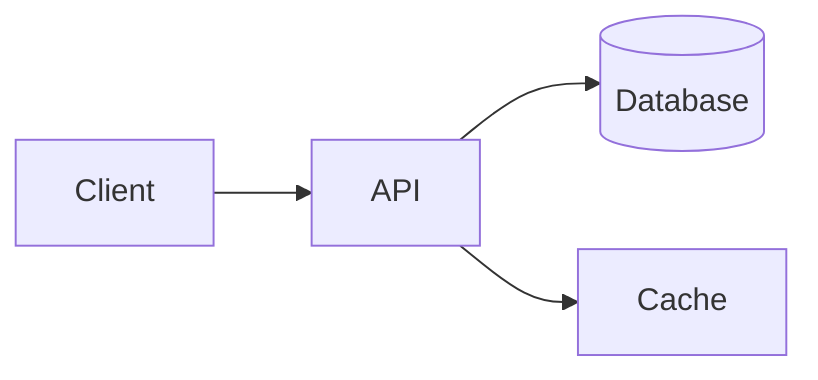
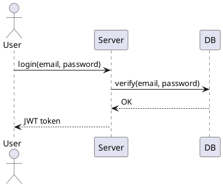
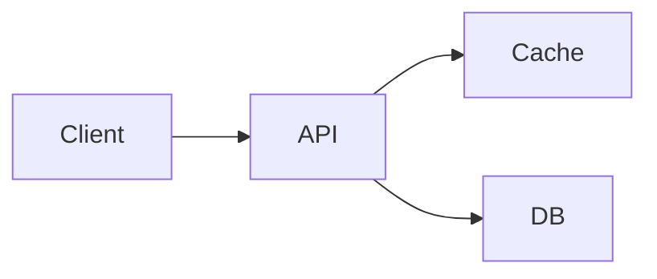
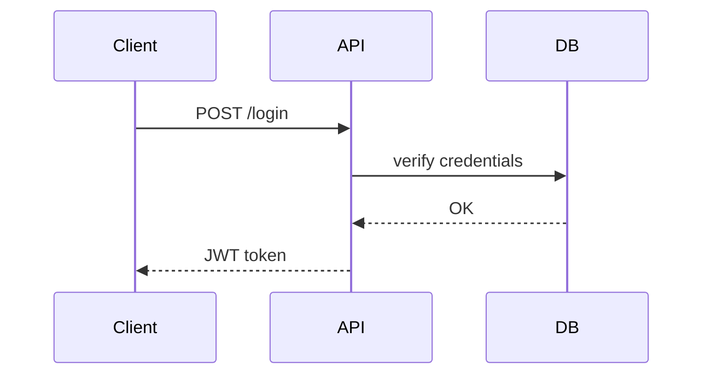

# DiagramMD — Format Specification v0.2

> Part of the [LearnSpec](/) suite. Draft.

## Core principle

DiagramMD serves a **dual role**:

- **Syntax specification** — the canonical reference for all diagram block types usable across the suite. Other specs (LearnMD, QuizMD, FlashMD) delegate diagram documentation to DiagramMD. A diagram block valid in DiagramMD is valid everywhere in the suite.
- **Standalone file format** — `.diagram.md` files contain reusable named diagrams, referenced via `!ref` from any content format and addressed individually by slug.

DiagramMD is a **pure leaf format**: it imports and references no other LearnSpec format, and is itself consumed via `!ref`, never via `!import`. How diagrams are rendered (server-side, client-side, hybrid) is left entirely to the player implementation.

DiagramMD inherits its frontmatter and validation rules from the shared [Architecture Charter](/charter/).

| Principle | Description |
|---|---|
| **Markdown-first** | A `.diagram.md` file is valid Markdown readable in any editor |
| **File-native** | All diagrams live in files — no database required |
| **Graceful degradation** | In any standard reader, each block displays as readable plain-text code |
| **Player-agnostic** | The spec defines syntax, not render implementation |
| **AI-native** | Generatable and consumable by an LLM without specific tooling |

## Format levels

| Level | Mechanism | Purpose |
|---|---|---|
| 0 | Diagram fenced blocks with minimal fields | Inline diagrams, readable everywhere |
| 1 | YAML frontmatter | File metadata (standalone only) |
| 2 | `id` attribute + enriched attributes | Reusable diagrams, captions, accessibility |

## Common block syntax

### Basic structure

````
```{type} [id:slug] [caption:"..."] [width:value] [alt:"..."]
[diagram source]
```
````

### Common attributes

| Attribute | Status | Description |
|---|---|---|
| `id` | Required when the block lives in a `.diagram.md` file (enables slug references). Optional when used inline. | Unique slug within the file. Enables block identification and cross-document referencing via `!ref` |
| `ref` | Only valid on a `diagram` fenced block; mutually exclusive with `id` and with a non-empty body | Declares a reference to the diagram with that `id` in a `!ref`-ed `.diagram.md` file. The body must be empty. See *Slug references* below |
| `caption` | Optional | Caption displayed below the diagram |
| `width` | Optional | Render width — CSS value (`80%`, `600px`, `100%`). Default: `100%` |
| `alt` | Recommended | Accessibility alt text describing the visual content |

### Graceful degradation

In any standard Markdown reader, a diagram block displays as a code block with the type name as the language identifier. The source content is readable as plain text — no understanding is lost.

## Diagram types

### `mermaid` — Text-based diagrams

[Mermaid.js](https://mermaid.js.org/) syntax for flowcharts, sequence diagrams, class diagrams, entity-relationship diagrams, Gantt charts, mindmaps, and timelines.

````markdown

````

**Supported Mermaid diagram types:**

| Keyword | Use case |
|---|---|
| `flowchart` / `graph` | Process flows, decision trees |
| `sequenceDiagram` | Component interactions |
| `classDiagram` | Object models, relationships |
| `erDiagram` | Database schemas |
| `gantt` | Schedules, milestones |
| `mindmap` | Topic hierarchies |
| `timeline` | Historical sequences |

**AI authoring recommendations:**
- Prefer `LR` orientation for sequential flows with more than 5 steps.
- Keep node labels under 40 characters; use `\n` to break longer ones.
- Avoid linear chains longer than 6 nodes; introduce subgraphs.
- Limit vertical depth to 7 levels in `TD` orientation.

### `tikz` — Scientific and technical diagrams

[TikZ/PGF](https://tikz.dev/) syntax for electrical circuits, physics diagrams, and geometry. Particularly suited to STEM content.

````markdown
```tikz caption:"Series RC circuit" width:60%
\begin{tikzpicture}
  \draw (0,0) to[R, l=$R$] (2,0)
              to[C, l=$C$] (4,0)
              to[battery, l=$V_0$] (4,2)
              -- (0,2) -- (0,0);
\end{tikzpicture}
```
````

### `graphviz` — Graphs and networks

[DOT language](https://graphviz.org/doc/info/lang.html) syntax for directed and undirected graphs, trees, and dependency networks.

````markdown
```graphviz caption:"Module dependencies" alt:"Dependency graph between modules A, B, C and D"
digraph deps {
    rankdir=LR;
    A -> B;
    A -> C;
    B -> D;
    C -> D;
}
```
````

### `plantuml` — UML diagrams

[PlantUML](https://plantuml.com/) syntax for activity, use case, component, deployment, and state diagrams.

````markdown

````

### `blockdiag` — Block diagrams

[blockdiag](http://blockdiag.com/) syntax for simple functional block diagrams.

````markdown
```blockdiag caption:"Processing pipeline"
blockdiag {
    Input -> Validation -> Processing -> Storage -> Output;
}
```
````

### `seqdiag` — Sequence diagrams (simplified syntax)

[seqdiag](http://blockdiag.com/en/seqdiag/) syntax for sequence diagrams with a simpler syntax than Mermaid.

````markdown
```seqdiag caption:"Client-server exchange"
seqdiag {
    Client -> Server -> DB;
    DB --> Server --> Client;
}
```
````

### `chess` — Chessboard

Displays a chess position from FEN notation or a PGN excerpt.

````markdown
```chess caption:"Position after 1.e4 e5 2.Nf3" alt:"Chessboard with pawns on e4 and e5, knight on f3"
rnbqkbnr/pppp1ppp/8/4p3/4P3/5N2/PPPP1PPP/RNBQKB1R b KQkq - 1 2
```
````

- **FEN (Forsyth-Edwards Notation)** — complete position on a single line.
- **PGN (Portable Game Notation)** — move sequence; the player displays the final position or enables move-by-move navigation.

### `abc` — Sheet music

[ABC notation](https://abcnotation.com/) syntax for sheet music.

````markdown
```abc play cursor caption:"Main theme"
X:1
T:Main Theme
M:4/4
L:1/8
K:C
|: G2 AB c2 BA | G4 E4 :|
```
````

**Attributes specific to `abc`:**

| Attribute | Description |
|---|---|
| `play` | Adds audio playback controls |
| `cursor` | Highlights the current note during playback (requires `play`) |
| `colors` | Colours each note by pitch class (requires `play`) |

### `smiles` — Chemical molecules

[SMILES](https://www.daylight.com/dayhtml/doc/theory/theory.smiles.html) notation for molecular structure representation.

````markdown
```smiles caption:"Caffeine" alt:"Molecular structure of caffeine"
CN1C=NC2=C1C(=O)N(C(=O)N2C)C
```
````

### `vega-lite` — Data visualisations

[Vega-Lite](https://vega.github.io/vega-lite/) JSON specification for charts and data visualisations.

````markdown
```vega-lite caption:"Grade distribution" alt:"Bar chart of grades from 0 to 20"
{
  "$schema": "https://vega.github.io/schema/vega-lite/v5.json",
  "mark": "bar",
  "data": {
    "values": [
      {"grade": "0-5", "count": 3},
      {"grade": "5-10", "count": 12},
      {"grade": "10-15", "count": 28},
      {"grade": "15-20", "count": 7}
    ]
  },
  "encoding": {
    "x": {"field": "grade", "type": "ordinal"},
    "y": {"field": "count", "type": "quantitative"}
  }
}
```
````

## Standalone `.diagram.md` files

### Structure

A `.diagram.md` file is a catalogue of named, reusable diagrams. Each block carries a unique `id` slug that other documents reference via `!ref`. The frontmatter is optional (Level 1).

````markdown
---
title: "Diagrams — System architecture"
lang: en
spec_version: "0.2"
tags: [architecture, backend]
---

# Diagrams — System architecture




````

`id` is required on every block in a `.diagram.md` file — a block without `id` is unreferenceable and produces a validation error.

## Referencing a DiagramMD from another format

### Declaration

A DiagramMD file is declared via the `!ref` directive at the top of the consuming document:

```markdown
!ref ./diagrams-architecture.diagram.md
!ref https://github.com/example/repo/blob/main/diagrams.diagram.md
```

Multiple `!ref` directives may coexist in the same document. The slugs from all referenced files share the same namespace — `id` values must therefore be unique across all DiagramMD files referenced in a given document.

### Slug references

Once a `.diagram.md` is declared via `!ref`, its diagrams are referenceable inline through a `diagram` fenced block with a `ref` attribute:

````markdown
```diagram ref:auth-flow
```
````

The block body is empty. At render time, a LearnSpec player resolves `auth-flow` to the corresponding block in the referenced `.diagram.md` file and renders it with that block's type, source, `caption`, `width`, and `alt`. Attributes set on the reference block itself (`caption`, `width`, `alt`) override the referenced block's values for this occurrence only.

In a standard Markdown reader, the block degrades gracefully to a readable `diagram` code block — no rendering is performed, but the reference is clearly visible.

**Granularity:** unlike `!import`, `!ref` does not splice content into the document — each diagram is materialised only where it is explicitly referenced by slug. To reuse the same diagram several times, simply repeat the reference block; to use only some diagrams from a catalogue, only reference those.

## Graceful degradation

| Element | Standard reader | LearnSpec player |
|---|---|---|
| Inline diagram block (` ```mermaid `, ` ```vega-lite `, …) | Readable code block | Rendered |
| `.diagram.md` file viewed directly | Sequence of readable code blocks with slugs visible | Catalogue source — not rendered directly |
| ` ```diagram ref:slug ` block in another format | Readable code block showing the slug | Resolved via the referenced `.diagram.md` — rendered as the target diagram |

## Interoperability

| Mechanism | Support |
|---|---|
| Referenced by LearnMD via `!ref` | ✅ |
| Referenced by QuizMD via `!ref` | ✅ |
| Referenced by FlashMD via `!ref` | ✅ |
| Consumed via `!import` | ❌ — leaf format, consumed only via `!ref` |
| `!import` or `!ref` of other formats | ❌ — leaf format |
| Referenced by TrackMD | ❌ — TrackMD orchestrates content formats, not leaf formats |

## Validation

### Lenient mode (default)

| Condition | Level |
|---|---|
| `lang` absent from frontmatter (standalone file) | Warning |
| Unrecognised block type | Warning |
| `id` missing on a block in a `.diagram.md` file | Error |
| Duplicate `id` within the file | Error |
| Duplicate `id` across all `.diagram.md` files `!ref`-ed by the same document | Error |
| `diagram` block with `ref:slug` whose slug is not found in any `!ref`-ed file | Error |
| `diagram` block with both `ref` and a non-empty body | Error |
| `diagram` block with both `ref` and `id` | Error |
| `alt` absent | Warning |
| Empty diagram source (non-reference block) | Error |
| `cursor` or `colors` on an `abc` block without `play` | Warning |

### Strict mode (`--strict`)

All warnings are promoted to errors.

## Relationship with LearnMD

DiagramMD v0.2 absorbs and replaces the diagram block documentation previously present in LearnMD v0.3 (`mermaid`, `abc`). LearnMD v0.4 delegates to DiagramMD as the canonical syntax reference for diagram blocks, consumes reusable named diagrams via `!ref`, and continues to support diagram blocks inline without any directive.
