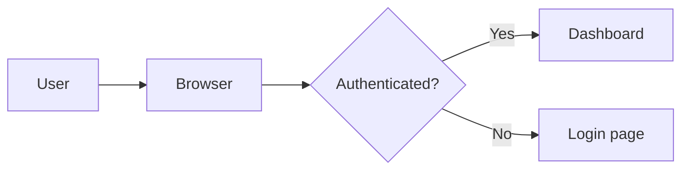
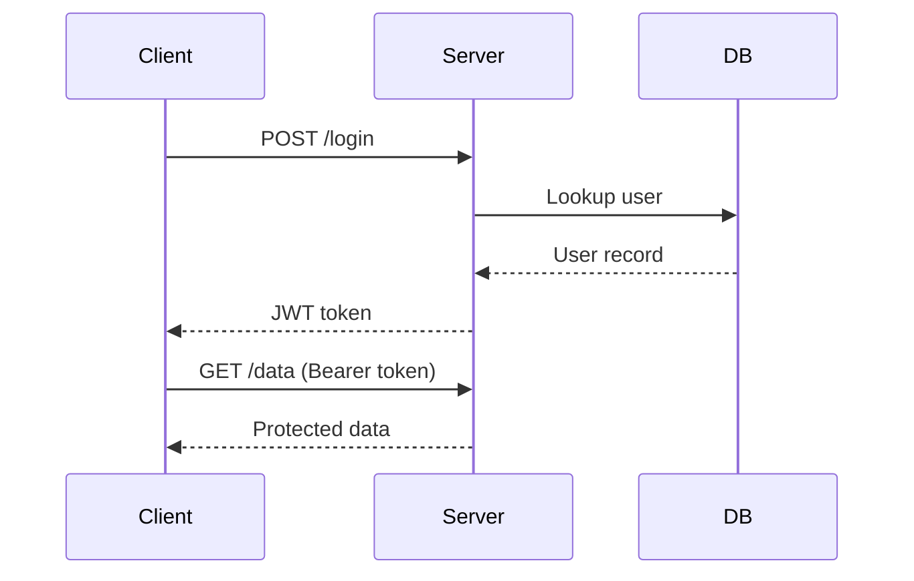
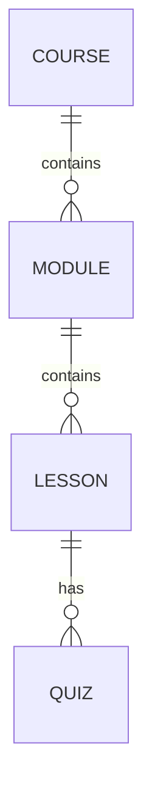

# LearnMD Examples

## Level 0 — Minimal lesson

The simplest possible LearnMD file is just Markdown:

````markdown
# Git Basics

## Module 1 — What is Git?

Git is a distributed version control system.
It tracks changes to files and lets multiple people
collaborate on the same project.

## Module 2 — Your First Commit

Open your terminal and run:

```bash
git init
git add .
git commit -m "Initial commit"
```
````

## Level 1 — With frontmatter and callouts

````markdown
---
title: CSS Flexbox
lang: en
estimated_time: 20min
tags: [css, layout, flexbox]
author: LearnSpec Contributors
---

# CSS Flexbox

## Module 1 — Flex Containers

> [!objectives]
> After this module, you will be able to:
> - Create a flex container
> - Align items along the main axis

To create a flex container, set `display: flex`:

```css
.container {
  display: flex;
  justify-content: center;
  align-items: center;
}
```

> [!tip]
> Use `justify-content` for the main axis and `align-items`
> for the cross axis.

> [!warning]
> Flex items shrink by default. Set `flex-shrink: 0` to prevent it.

> [!summary]
> - `display: flex` creates a flex container
> - `justify-content` aligns on the main axis
> - `align-items` aligns on the cross axis
````

## Level 2 — With inline quizzes and imports

````markdown
---
title: Introduction to SQL
lang: en
estimated_time: 45min
tags: [sql, databases]
---

# Introduction to SQL

## Module 1 — SELECT Queries

The `SELECT` statement retrieves data from a table:

```sql
SELECT name, age FROM users WHERE age > 18;
```

```quiz
? Which SQL keyword filters rows?
- [ ] SELECT
- [x] WHERE
- [ ] FROM
- [ ] ORDER BY
```

## Module 2 — Joins

!import ./joins.learn.md
!import ./check-joins.quiz.md
````

## Progress checkpoints

Use `!checkpoint` directives to mark learner progress milestones within a lesson. Checkpoints appear as standalone lines and work across multiple modules.

````markdown
---
title: Python Functions
lang: en
estimated_time: 40min
tags: [python, functions, beginner]
---

# Python Functions

## Module 1 — Defining Functions

A function groups reusable code under a name:

```python
def greet(name):
    return f"Hello, {name}!"

print(greet("Alice"))  # Hello, Alice!
```

> [!tip]
> Use descriptive names — `calculate_total()` is clearer than `calc()`.

!checkpoint id:module-1-done

## Module 2 — Parameters and Return Values

Functions can take multiple parameters and return a value:

```python
def add(a, b):
    return a + b

result = add(3, 4)  # 7
```

!checkpoint id:module-2-done label:"Module 2 — Parameters complete"

## Module 3 — Default Parameters and *args

Default values make parameters optional:

```python
def power(base, exp=2):
    return base ** exp

power(3)     # 9
power(3, 3)  # 27
```

Use `*args` to accept a variable number of arguments:

```python
def total(*numbers):
    return sum(numbers)

total(1, 2, 3, 4)  # 10
```

!checkpoint id:module-3-done label:"Module 3 complete" type:milestone

```quiz
? Which keyword is used to define a function in Python?
- [ ] function
- [x] def
- [ ] fn
- [ ] define
```
````

The three `!checkpoint` forms above show:

| Form | Syntax | When to use |
|------|--------|-------------|
| Minimal | `!checkpoint id:slug` | Simple progress marker |
| With label | `!checkpoint id:slug label:"..."` | When learners see a display name |
| Full | `!checkpoint id:slug label:"..." type:milestone` | Explicit milestone or exercise gate |

> [!note]
> When a `!import ./quiz.quiz.md` or inline `quiz` block is present at the same position, it already acts as a checkpoint — no additional `!checkpoint` line is needed there.

## Math content

````markdown
---
title: Calculus — Derivatives
lang: en
estimated_time: 30min
tags: [math, calculus]
---

# Calculus — Derivatives

## Definition

The derivative of $f$ at point $x$ is defined as:

$$f'(x) = \lim_{h \to 0} \frac{f(x+h) - f(x)}{h}$$

## Basic Rules

| Function | Derivative |
|----------|------------|
| $x^n$ | $nx^{n-1}$ |
| $e^x$ | $e^x$ |
| $\ln(x)$ | $1/x$ |
| $\sin(x)$ | $\cos(x)$ |

```quiz scored:true
? What is the derivative of $x^3$?
- [x] $3x^2$
- [ ] $x^2$
- [ ] $3x^3$
```
````

## Diagrams (Mermaid)

Mermaid diagrams are defined as fenced code blocks and rendered client-side.

### Flowchart

````markdown

````

### Sequence diagram

````markdown

````

### Entity-Relationship diagram

````markdown

````

> **Note:** Static image embeds (``) are not supported. Use Mermaid for all diagram needs.
