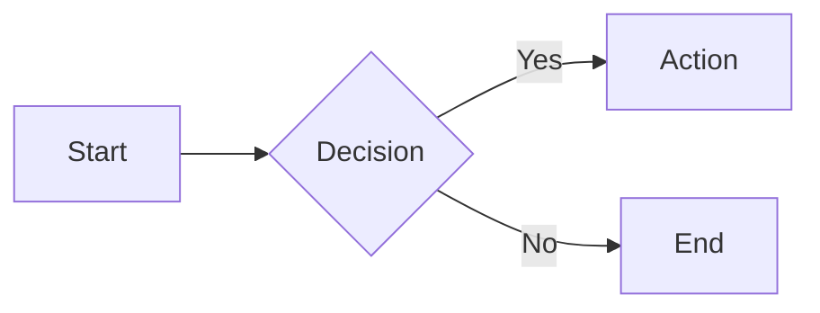
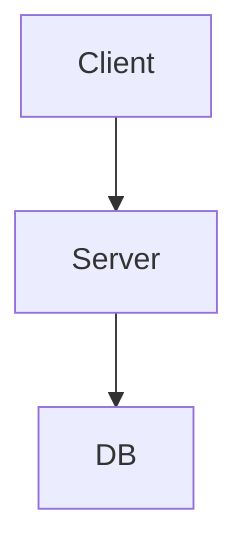

# LearnMD — Format Specification v0.3

## Core principle: Markdown first

LearnMD is the **companion format to QuizMD**: where QuizMD covers assessment (testing what you know), LearnMD covers instruction (explaining what to know). Together they form a complete **teach → assess** stack, all in portable plain-text files.

**A complete learning path — chapters, lessons, exercises, quizzes — can live in a single valid `.learn.md` file.** The `!import` directive is an optimization tool for reusability, not a prerequisite.

| Principle | Description |
|-----------|-------------|
| **Markdown-first** | A `.learn.md` file is valid Markdown — readable in any editor |
| **Git-native** | Versionable, diffable, and mergeable like code |
| **AI-native** | Generatable and consumable by LLMs without special tooling |
| **Progressively enriched** | Plain text (Level 0) up through special fenced blocks (Level 2) |
| **QuizMD-interoperable** | Inline ` ```quiz ` blocks and `!import` directive to embed checkpoints |

---

## Format levels

| Level | Mechanism | Purpose |
|-------|-----------|---------|
| 0 | Plain `.learn.md`, pure Markdown | Minimal learning content, human-readable |
| 1 | YAML frontmatter + GFM callouts | Metadata, estimated time, language |
| 2 | Special fenced blocks + directives | Examples, summaries, inline quizzes, imports |

Each level is a strict superset of the previous one. A Level 0 file is valid at Level 1 and 2.

---

## Document architecture

### Three-tier hierarchy

```
path (.learn.md, minimal or no frontmatter)
└── module (## heading)
    └── lesson (### heading or file imported via !import)
```

- Structure is **strictly linear** in v0.3 (no branching)
- ` ```quiz ` blocks and `!import` directives are usable at any level
- External content is referenced via native Markdown links `[text](url)` and ``

---

## Level 0 — Plain Markdown

### Conventions

| Syntax | Meaning |
|--------|---------|
| `# Title` | Document title (inferred by the parser if absent from frontmatter) |
| `## Module title` | Main section heading |
| `### Lesson title` | Sub-section heading |
| `> text` | Generic blockquote or note |
| `!import ./file.learn.md` | Include another lesson file |
| `!import ./file.quiz.md` | Embed a QuizMD checkpoint from an external file |
| `!checkpoint id:slug` | Mark a learner progress checkpoint |
| `$...$` | Inline LaTeX math formula |
| `$$...$$` | Block (display) LaTeX math formula |

### Minimal example

````markdown
# Introduction to Python

## Module 1 — Variables

A variable is a named reference to a value in memory.

```python
age = 25
```

## Module 2 — Conditions

An `if` statement runs code only when a condition is true.

```python
if age >= 18:
    print("Adult")
```
````

---

## Level 1 — YAML frontmatter

A YAML block at the top of the `.learn.md` file, between two `---` lines.

```yaml
---
title: Python Variables       # optional — inferred from the first # H1 if absent
lang: en                      # REQUIRED — BCP-47 code (en, fr, en-US, …)
estimated_time: 15min         # optional — free-form duration string
tags: [python, variables]     # optional — list of strings
author: Jane Smith            # optional — string or {name, email, url}
---
```

### Frontmatter field reference

| Field | Required | Type | Description |
|-------|----------|------|-------------|
| `title` | No | string | Overrides the first `# H1`. Inferred from H1 if absent. |
| `lang` | **Yes** | BCP-47 | Language code: `en`, `fr`, `en-US`, etc. |
| `estimated_time` | No | string | Free-form estimated reading/study time: `15min`, `1h30`, `2h` |
| `tags` | No | string[] | Thematic tags |
| `author` | No | string or object | Author name, or `{name, email, url}` |
| `spec_version` | No | string | LearnMD spec version this file targets (e.g. `"0.3"`) |

`lang` is the only required field. All other fields are optional.

### GFM callouts

Callouts use GitHub Flavored Markdown syntax and are rendered with visual emphasis by compatible players.

**Supported everywhere** (GitHub, Obsidian, neuroneo.md):

| Syntax | Semantic | Typical use |
|--------|----------|-------------|
| `> [!note]` | Note | Supplementary information |
| `> [!tip]` | Tip | Best practice, shortcut, helpful advice |
| `> [!warning]` | Warning | Common pitfall, frequent mistake |
| `> [!important]` | Important | Critical point to remember |
| `> [!caution]` | Caution | Risk of error or data loss |

**Supported on Obsidian and neuroneo.md** (degrade gracefully to a blockquote on GitHub):

| Syntax | Semantic | Typical use |
|--------|----------|-------------|
| `> [!summary]` | Summary | Key takeaways at the end of a lesson |
| `> [!example]` | Example | Non-code illustrative example |
| `> [!objectives]` | Learning Objectives | What the learner will be able to do after this lesson — place at the top |

```markdown
> [!warning]
> In Python, variable names are case-sensitive:
> `Age` and `age` are two different variables.
```

```markdown
> [!tip]
> Use descriptive names: `student_count` is clearer than `n`.
```

---

## Level 2 — Special fenced blocks and directives

Special blocks follow the same fenced syntax as QuizMD. They add structured, semantically meaningful containers to the lesson content.

### Inline quiz checkpoint

Embeds a **single question** using QuizMD syntax directly in the lesson. All QuizMD question types are supported: `mcq`, `multi`, `open`, `tf`, `match`, `order`.

**Syntax:**

````markdown
```quiz
? What operator assigns a value in Python?
- [x] =
- [ ] ==
- [ ] :=
```
````

The question starts with `?` followed by the question text. Answer choices use `- [x]` (correct) and `- [ ]` (incorrect), identical to QuizMD Level 0.

**Attributes** (appended after the word `quiz` on the opening line):

| Attribute | Default | Description |
|-----------|---------|-------------|
| `scored:false` | Yes (default) | Practice mode — immediate feedback, no score recorded |
| `scored:true` | — | Scored checkpoint — contributes to lesson score |

**Inline quiz vs external file:**

| Need | Syntax |
|------|--------|
| Single simple question | Inline ` ```quiz ` block |
| Multiple questions, advanced scoring, or shared config | `!import ./file.quiz.md` directive |

### Fenced callout blocks

Fenced callout blocks are **Level 2 alternatives to GFM callouts**. They support richer content (multi-paragraph, nested lists, syntax-highlighted code) and are rendered with a visual header by compatible players.

**Supported block types:**

| Language | Icon | Label | Typical use |
|----------|------|-------|-------------|
| ` ```note ` | :memo: | Note | Supplementary information |
| ` ```tip ` | :bulb: | Tip | Best practice or helpful advice |
| ` ```warning ` | :warning: | Warning | Common pitfall, frequent mistake |
| ` ```important ` | :exclamation: | Important | Critical point to remember |
| ` ```caution ` | :red_circle: | Caution | Risk of error or data loss |
| ` ```summary ` | :white_check_mark: | Summary | Key takeaways at the end of a lesson |
| ` ```example ` | :mag: | Example | Illustrative example |
| ` ```objectives ` | :dart: | Learning Objectives | What the learner will achieve — place at top |

**Optional title attribute** (`title:"..."`):

````markdown
```example title:"Token prediction"
Context: "The capital of France is"
Most likely token: " Paris"
Less likely token: " Lyon"
```
````

**Optional code language** — place the language identifier before `title:` to render the body as a syntax-highlighted code block:

````markdown
```example python title:"Assigning and reassigning a variable"
score = 0
print(score)   # → 0

score = 42
print(score)   # → 42
```
````

### Composition directives

#### `!import <path>`

Includes content from another file at the current position. The file type is detected from the extension:

- **`.learn.md`** — lesson content is inserted inline (frontmatter ignored)
- **`.quiz.md`** — renders as an interactive QuizMD checkpoint

```markdown
!import ./03-conditions.learn.md
!import ./check-variables.quiz.md
```

Behavior:
- The imported file's content is inserted at the position of the directive.
- For `.learn.md`: the file's content is rendered inline. Frontmatter is ignored.
- Imports are recursive: an imported file may itself contain `!import` directives.
- Circular imports are silently skipped.

#### `!checkpoint id:slug [label:"..."] [type:...]`

Marks a named progress point in the lesson. When a learner reaches (or explicitly confirms) a checkpoint, compatible players persist the event and can display a progress indicator.

**Syntax:**

```markdown
!checkpoint id:module-1-done label:"Module 1 terminé"
```

**Attributes:**

| Attribute | Required | Default | Description |
|-----------|----------|---------|-------------|
| `id` | **Yes** | — | Unique identifier within the lesson (used for progress tracking) |
| `label` | No | `"Checkpoint"` | Display text shown to the learner |
| `type` | No | `milestone` | `milestone` / `read` / `exercise-complete` |

**Rules:**

- Appears as a standalone line (like `!import`)
- `id` values must be unique within a document
- Multiple checkpoints per lesson are allowed
- When a `!import ./quiz.quiz.md` is present, the quiz itself acts as a natural checkpoint — an additional `!checkpoint` at the same position is redundant
- Compatible players display a visual progress marker at the checkpoint position; non-compatible parsers render the directive as raw text (graceful degradation)

**Example:**

```markdown
## Module 1 — Variables

Content here...

!checkpoint id:module-1-done label:"Module 1 terminé"

## Module 2 — Conditions

Content here...

!checkpoint id:module-2-done label:"Module 2 terminé"
```

**JSON output from `parse_learn`:**

The parser exposes a top-level `checkpoints[]` array:

```json
{
  "checkpoints": [
    { "id": "module-1-done", "label": "Module 1 terminé", "type": "milestone", "position": 42 },
    { "id": "module-2-done", "label": "Module 2 terminé", "type": "milestone", "position": 87 }
  ]
}
```

---

## Math support

LearnMD uses LaTeX formulas rendered via KaTeX. Math is **auto-detected**: no frontmatter flag is required.

| Form | Syntax | Rendering |
|------|--------|-----------|
| Inline | `$E = mc^2$` | Embedded in the line of text |
| Block (display) | `$$\int_0^\infty e^{-x}\,dx = 1$$` | Centered on its own line |

---

## ABC music notation

LearnMD supports **ABC notation** for embedding sheet music. Compatible renderers use abcjs to produce SVG output directly in the browser.

Use a fenced code block with the language identifier `abc`, optionally followed by flags:

| Flag | Description |
|------|-------------|
| *(none)* | Static SVG score only |
| `play` | Adds audio controls |
| `cursor` | Highlights the current note during playback (requires `play`) |
| `colors` | Colors each note by pitch class (requires `play`) |

---

## Penrose diagrams

LearnMD supports **Penrose** declarative mathematical diagrams, rendered via @penrose/core. Three sections separated by `---`:

1. **domain** — Declares types, predicates, and constructors
2. **style** — Maps domain elements to visual shapes and layout
3. **substance** — Describes the specific mathematical objects to draw


---

## Mermaid diagrams

LearnMD supports **Mermaid** text-based diagrams via [Mermaid.js](https://mermaid.js.org/). Diagrams can appear anywhere in a lesson document.

> **Note:** Static image embeds (``) are **not supported** for security reasons. Mermaid diagrams are defined as text and rendered client-side.

### Syntax

````markdown

````

Optional block attributes:

````markdown

````

| Attribute | Type | Description |
|-----------|------|-------------|
| `caption` | string | Caption displayed below the diagram |
| `width` | CSS value | Diagram width (e.g. `100%`, `600px`) |

### Supported diagram types

| Type | Keyword | Example use |
|------|---------|-------------|
| Flowchart | `flowchart` / `graph` | Process flows, decision trees |
| Sequence | `sequenceDiagram` | API call flows, interactions |
| Class | `classDiagram` | OOP relationships, data models |
| Entity-Relationship | `erDiagram` | Database schemas |
| Gantt | `gantt` | Project timelines |
| Mindmap | `mindmap` | Topic hierarchies |
| Timeline | `timeline` | Historical sequences |

### AI authoring

Mermaid syntax is text-based and AI-generatable. When authoring with Claude or MCP tools, you can request diagrams inline and they will be emitted as valid `` ```mermaid `` blocks.

### Constraints

- Mermaid is **auto-detected**: the runtime loads only when a `` ```mermaid `` block is present.
- Full reference: [mermaid.js.org](https://mermaid.js.org/)

---

## Syntax reference table

| Element | Syntax | Level |
|---------|--------|-------|
| Document title | `# Title` | 0 |
| Module heading | `## Module title` | 0 |
| Lesson heading | `### Lesson title` | 0 |
| Generic blockquote | `> text` | 0 |
| Import lesson | `!import ./file.learn.md` | 0 |
| Embed quiz checkpoint | `!import ./file.quiz.md` | 0 |
| Progress checkpoint | `!checkpoint id:slug [label:"..."] [type:...]` | 0 |
| Inline math | `$formula$` | 0 |
| Block math | `$$formula$$` | 0 |
| Frontmatter | `---` YAML `---` | 1 |
| Note callout | `> [!note]` | 1 |
| Tip callout | `> [!tip]` | 1 |
| Warning callout | `> [!warning]` | 1 |
| Important callout | `> [!important]` | 1 |
| Summary callout | `> [!summary]` | 1 |
| Example callout | `> [!example]` | 1 |
| Objectives callout | `> [!objectives]` | 1 |
| Inline quiz question | ` ```quiz ` | 2 |
| Scored inline quiz | ` ```quiz scored:true ` | 2 |
| Note callout (fenced) | ` ```note ` | 2 |
| Summary callout (fenced) | ` ```summary ` | 2 |
| Example callout (fenced) | ` ```example [lang] [title:"..."] ` | 2 |
| Objectives callout (fenced) | ` ```objectives ` | 2 |
| ABC (static) | ` ```abc ` | 0 |
| ABC (interactive) | ` ```abc play cursor colors ` | 0 |
| Mermaid diagram | ` ```mermaid ` diagram text ` ``` ` | 0 |
| Mermaid (with caption) | ` ```mermaid caption:"..." width:80% ` | 0 |

---

## Validation

### Lenient mode (default)

| Condition | Level |
|-----------|-------|
| `lang` absent from frontmatter | Warning |
| Title absent (no H1 and no frontmatter `title`) | Warning |
| Unclosed fenced block | Error |
| Inline quiz block with no `?` line | Error |
| `!checkpoint` missing required `id` attribute | Error |
| Duplicate `!checkpoint` `id` within a document | Error |
| `!import` pointing to a missing file | Warning |

### Strict mode (`--strict`)

| Condition | Level |
|-----------|-------|
| `lang` absent | Error |
| Title absent | Error |
| All lenient-mode errors | Error |

Strict mode is recommended for CI pipelines and production publishing. Lenient mode is appropriate during authoring.
